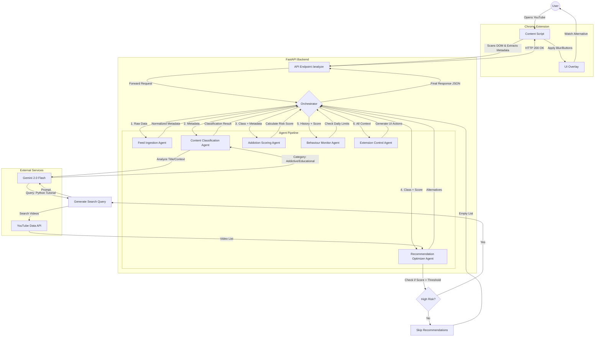

# LLM and ML Flow Documentation

This document outlines the architecture and data flow for the FeedZenAI project, specifically focusing on how the Large Language Model (LLM) and Machine Learning (ML) components interact within the multi-agent system.

## High-Level Architecture

The system consists of a Chrome Extension that acts as the eyes and hands of the application, and a FastAPI Backend that serves as the brain. The backend employs an Orchestrator pattern to manage a pipeline of specialized agents.

### Core Technologies
- **LLM**: Gemini 2.0 Flash (for fast classification and recommendation generation).
- **External Data**: YouTube Data API v3 (for fetching real video alternatives).
- **Orchestration**: Custom Python-based agent pipeline.

## Detailed Flow Diagram

The following Mermaid diagram illustrates the step-by-step processing of a video feed item, from the moment it appears on the user's screen to the final intervention decision.

## Agent Roles & Data Transformation

| Agent | Input | Operation | Output |
|-------|-------|-----------|--------|
| **FIA** | Raw DOM elements | Normalization, Validation | Structured Metadata (Title, Duration, Channel) |
| **CCA** | Metadata | **LLM Call**: Classify intent (Clickbait vs. Educational) | Category, Confidence Score |
| **ASA** | Metadata, Category | Weighted Scoring Algorithm | Addiction Score (0-10), Risk Level |
| **ROA** | Category, Score | **LLM Call**: Generate productive query **API Call**: Fetch YouTube videos | List of Alternative Videos |
| **BMA** | User History | Statistical Analysis | Daily Usage Stats, Warning Flags |
| **CECA**| All Agent Outputs | UI Logic Generation | JSON Instructions for Chrome Extension (Blur, Buttons) |

## Key Interactions

1.  **Classification (CCA)**: We use Gemini 2.0 Flash because it provides nuanced understanding of video titles that simple keyword matching cannot catch (e.g., distinguishing "Python Fails" from "Python Tutorial").
2.  **Recommendation (ROA)**: Instead of hallucinating video links, we use the LLM to *generate a search query* based on the user's interests (context), and then use the **YouTube Data API** to fetch *actual, playable videos*. This ensures 100% link validity.
3.  **Orchestration**: The Orchestrator manages the state between agents, ensuring that downstream agents (like ROA) have access to the outputs of upstream agents (like CCA and ASA).
